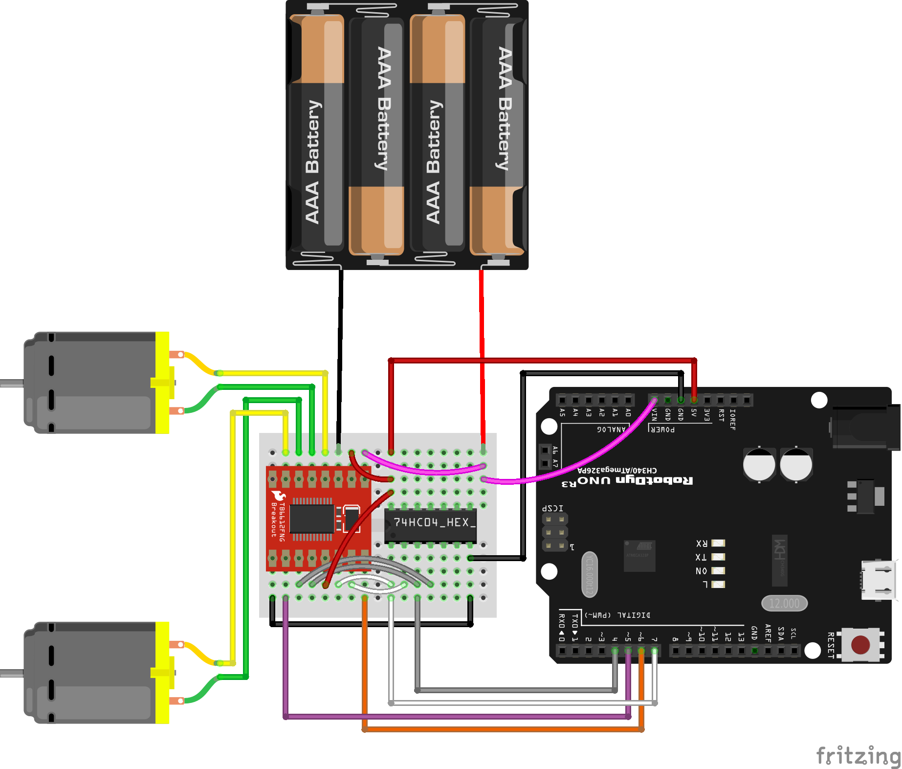

# Fritzing stuff of the project

## Fritzing parts

* Proto Shield R3 with miniBreadBoard **Fritzing part**: 

## Fritzing sketches

* **Esquema de montaje** driver y motores DC: 

## LICENSE

This work is licensed under the [GNU General Public License v3.0](LICENSE-GPLV30). All media and data files that are not source code are licensed under the [Creative Commons Attribution 4.0 BY-SA license](LICENSE-CCBYSA40).

More information about licenses in [Opensource licenses](https://opensource.org/licenses/) and [Creative Commons licenses](https://creativecommons.org/licenses/).